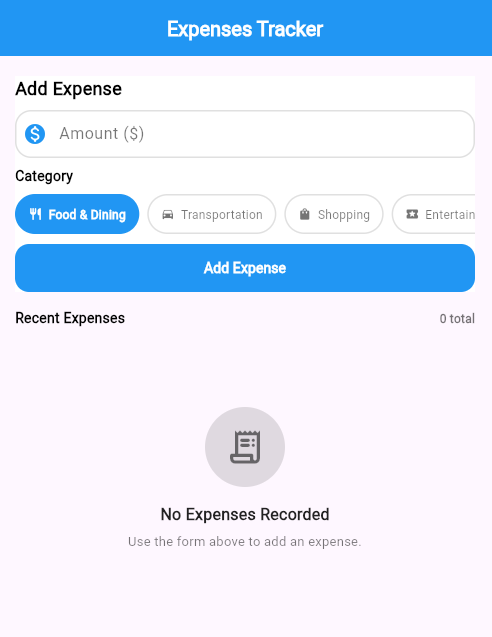
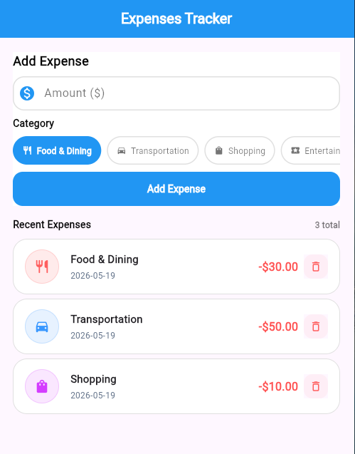

# Expenses Tracker app

A modern, highly modular, and lightweight Expense Tracker application built with Flutter. The app utilizes the BLoC/Cubit pattern for state management and features a sleek, hardcoded Blue, White, and Black design.

## Features

- **Inline Add Expense Form**: Quickly log expenses with an amount and dynamic category selection.
- **Automatic Timestamps**: Date selection is handled automatically (defaults to the current timestamp) for speed and simplicity.
- **Reactive Expense List**: High-contrast, clean feed of recent transactions that updates immediately upon state changes.
- **Delete & Undo Actions**: Easily discard expenses using the delete action and recover them using the undo option in the custom feedback snackbar.
- **Modular Architecture**: Clean separation of state management, data models, and UI widgets for optimal maintainability.
- **Premium Visuals**: Custom high-contrast UI designed with a curated Blue, White, and Black color palette.

---

## Preview

<p align="center">
  
  &nbsp;&nbsp;&nbsp;&nbsp;
  
</p>

---

## Folder Structure

```text
lib/
├── main.dart                      # App entrypoint and BlocProvider setup
└── expense_tracker/
    ├── cubits/
    │   ├── expense_cubit.dart     # Action-handler logic (Add, Delete)
    │   └── expense_state.dart     # Defined state subclasses (Initial, Added, Deleted)
    ├── models/
    │   └── expense.dart           # Expense schema & Category enum definitions
    ├── widgets/
    │   ├── add_expense_form.dart  # Form widget for category selection & amount input
    │   ├── expense_card.dart      # Individual outflow card layout with actions
    │   └── expenses_list.dart     # Scrollable view of list of expenses
    └── expense_tracker_screen.dart# Primary screen container layout
```

---

## State Management

This application leverages the **Cubit** pattern via the `flutter_bloc` package.

- **`ExpenseState`**: A sealed class representing different UI states (`ExpenseInitial`, `ExpenseAdded`, `ExpenseDeleted`).
- **`ExpenseCubit`**: Governs application logic:
  - `addExpense()` creates a new `Expense` and emits an `ExpenseAdded` state.
  - `deleteExpense()` removes the specific item and emits an `ExpenseDeleted` state.

---
